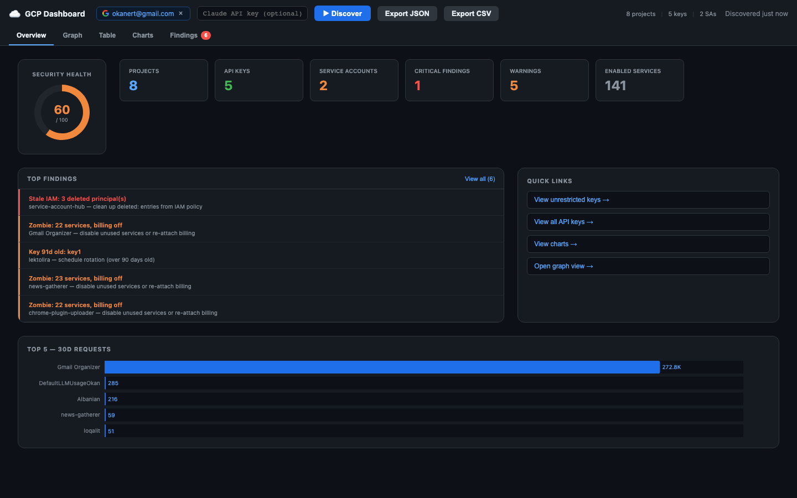
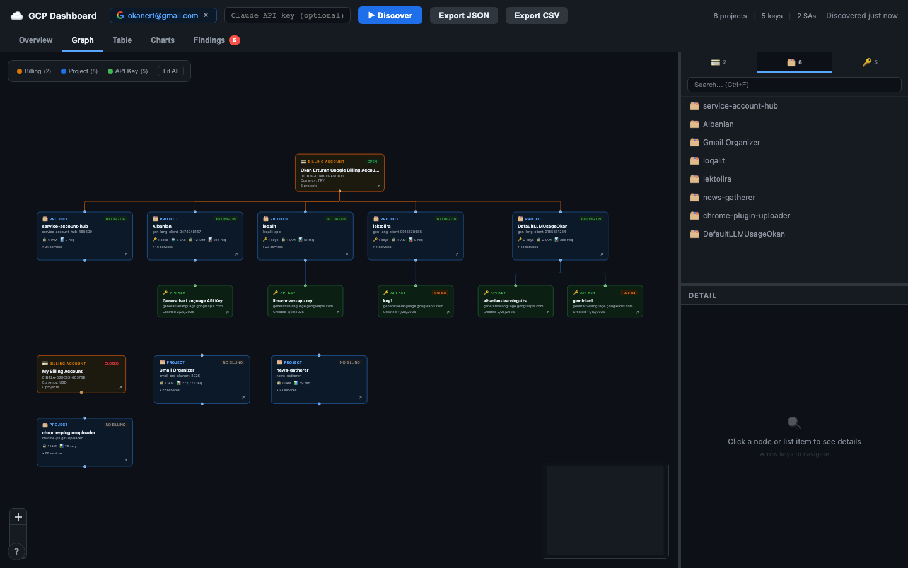
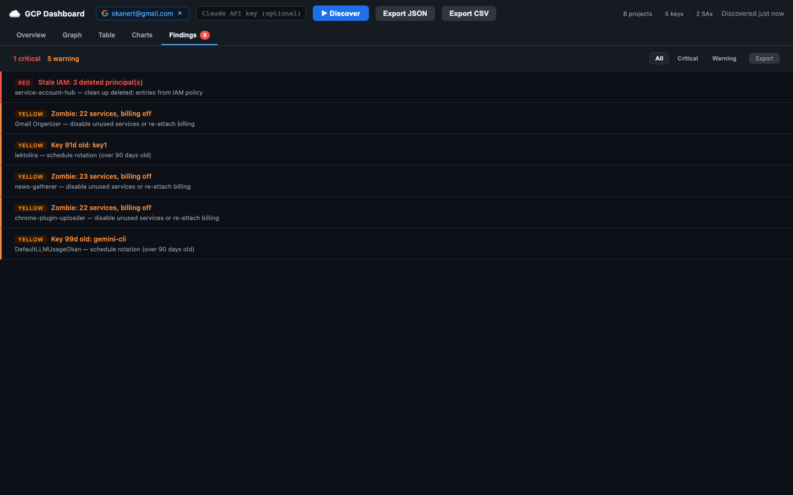

<p align="center">
  
</p>

<h1 align="center">GCP Audit Dashboard</h1>

<p align="center">
  <strong>Discover, visualize, and audit your Google Cloud Platform infrastructure in a single client-side dashboard.</strong>
</p>

<p align="center">
  <a href="LICENSE">
    
  </a>
  
  
  
</p>

<p align="center">
  <a href="#quick-start">Quick Start</a> •
  <a href="#features">Features</a> •
  <a href="#how-it-works">How It Works</a> •
  <a href="#security-model">Security</a> •
  <a href="#export">Export</a>
</p>

---

GCP Audit Dashboard connects to your Google Cloud account using OAuth or the gcloud CLI, discovers every project, billing account, API key, service, IAM policy, and service account, then renders the whole picture as an interactive node graph with built-in security findings. Optionally, hand the data to Claude for deeper AI-powered analysis. Everything runs in the browser - there is no backend server.

## Features

- **Automatic Resource Discovery** - Scans billing accounts, projects, API keys, enabled services, IAM policies, service accounts, and usage metrics in parallel
- **Interactive Graph Visualization** - Explore your GCP hierarchy as a node graph with color-coded resource types and automatic tree layout
- **Built-in Security Findings** - Detects unrestricted API keys, stale keys (90d/180d), public IAM bindings, deleted principals, disabled service accounts with active roles, zombie projects, and overprivileged service accounts
- **Security Health Score** - A 0-100 score calculated from critical findings and warnings, displayed as a donut chart on the overview dashboard
- **AI-Powered Analysis (Optional)** - Send your discovered infrastructure to Claude for deeper security and cost insights with per-resource severity ratings and actionable suggestions
- **Five Dashboard Views** - Overview (stats + charts + top findings), Graph (interactive node map), Table (sortable resource list), Charts (usage bar charts), and Findings (filterable security report)
- **Export to JSON and CSV** - Download your full audit data as structured JSON or a flat CSV of projects, keys, and services
- **Detail Drawer** - Click any resource to open a side panel with full metadata, IAM bindings, and service details
- **Search and Filter** - Filter the graph by resource type or search across all nodes
- **Dark Theme** - Purpose-built dark UI optimized for security operations

## Screenshots

<p align="center">
  
  <br/>
  <em>Overview dashboard with health score, stat cards, top findings, and usage charts</em>
</p>

<p align="center">
  
  <br/>
  <em>Interactive node graph showing billing accounts, projects, API keys, and services</em>
</p>

<p align="center">
  
  <br/>
  <em>Security findings view with severity filtering and one-click navigation to affected resources</em>
</p>

## Quick Start

### Prerequisites

- **Node.js 18+** and npm
- **Google Cloud account** with at least one project
- **gcloud CLI** installed and authenticated (recommended), or a Google OAuth Client ID

### Install and Run

```bash
# Clone the repository
git clone https://github.com/okturan/gcp-audit-dashboard.git
cd gcp-audit-dashboard

# Install dependencies
npm install

# (Recommended) Authenticate with gcloud CLI
gcloud auth login
gcloud auth application-default login

# Start the dev server
npm run dev
```

Open the URL printed by Vite (typically `http://localhost:5173`, but Vite will pick the next available port if 5173 is in use). If gcloud CLI credentials are detected, authentication happens automatically and discovery begins right away.

### Alternative: Google OAuth

If you prefer OAuth instead of the gcloud CLI:

1. Create an OAuth 2.0 Client ID in the [Google Cloud Console](https://console.cloud.google.com/apis/credentials)
2. Add the local dev URL (e.g. `http://localhost:5173`) as an authorized JavaScript origin
3. Paste the Client ID into the sign-in screen and click **Sign In with Google**

### Production Build

```bash
npm run build
npm run preview
```

## How It Works

### 1. Authentication

The dashboard supports two auth methods:

- **gcloud CLI (automatic)** - On load, the app calls a local dev-server endpoint that reads your gcloud application-default credentials. Tokens refresh automatically every 55 minutes.
- **Google OAuth (manual)** - Uses Google Identity Services to request an access token via a popup consent flow. The token is held in memory only.

Both methods request **read-only scopes**:

```
cloud-platform.read-only
cloud-billing.readonly
monitoring.read
```

### 2. Discovery

The `discoverAll()` orchestrator runs in parallel:

1. Fetches all **billing accounts** and **projects** concurrently
2. For each project, fires six parallel requests: billing info, API keys, enabled services, usage metrics (Cloud Monitoring 30-day rollup), IAM policy, and service accounts
3. Uses `Promise.allSettled` throughout so a single API failure never blocks the full scan
4. Reports real-time progress (e.g., "Loading project 3 of 12")

### 3. Graph Building

Discovered resources are converted into typed React Flow nodes with a deterministic ID scheme:

| Resource | Node ID Format | Color |
|----------|----------------|-------|
| Billing Account | `billing-{accountId}` | Gold/amber |
| Project | `project-{projectId}` | Blue |
| API Key | `apikey-{uid}` | Green |
| Service | `service-{projectId}-{serviceName}` | Gray |

Edges connect projects to their billing account, and API keys and services to their parent project. Layout is computed using a custom hierarchical tree algorithm.

### 4. AI Analysis (Optional)

If you provide a Claude API key, the dashboard sends a compact JSON summary of your infrastructure to Claude Sonnet. Claude returns per-resource insights with severity levels (green / yellow / red), one-line summaries, and actionable suggestions. Insights are overlaid onto the graph nodes and surfaced in the findings view.

## Security Model

This project was designed with security as a first-class concern:

- **Fully Client-Side** - There is no backend server. All API calls go directly from the browser to Google Cloud APIs and (optionally) the Anthropic API.
- **No Token Persistence** - OAuth access tokens are held in JavaScript module-scoped variables, never written to localStorage or cookies. They are lost on page close. Only the OAuth Client ID (a public, non-secret value) and UI layout preferences are persisted to localStorage.
- **No API Key Persistence** - The Claude API key is kept in component state only. It is never persisted to any storage.
- **Read-Only Scopes** - The app only requests `read-only` and `readonly` OAuth scopes. It cannot modify your GCP resources.
- **Content Security Policy** - The HTML includes a strict CSP header that restricts script sources to `self` and `accounts.google.com`, blocks iframes entirely, and limits network connections to `*.googleapis.com` and `api.anthropic.com`.
- **Session Cache with Expiry** - Discovery results are cached in `sessionStorage` for page-refresh resilience but expire after 30 minutes and are validated before use.

## Tech Stack

| Layer | Technology |
|-------|------------|
| Framework | [React 19](https://react.dev) |
| Language | [TypeScript 5.9](https://www.typescriptlang.org) |
| Build Tool | [Vite 7](https://vite.dev) |
| Graph Rendering | [@xyflow/react 12](https://reactflow.dev) (React Flow) |
| Graph Layout | Custom hierarchical tree layout |
| Charts | [Recharts 3](https://recharts.org) |
| State | [Zustand 5](https://zustand.docs.pmnd.rs) |
| AI Analysis | [Anthropic SDK](https://docs.anthropic.com) (Claude Sonnet) |
| Auth | [Google Identity Services](https://developers.google.com/identity) |

## Project Structure

```
src/
├── auth/
│   └── GoogleOAuth.ts           # OAuth token management and GIS integration
├── claude/
│   └── enricher.ts              # Sends GCP data to Claude, parses insights
├── components/
│   ├── CredentialLoader.tsx     # Sign-in screen (gcloud auto-detect + OAuth)
│   ├── DetailDrawer.tsx         # Slide-out resource detail panel
│   ├── DetailPanel.tsx          # Full resource metadata renderer
│   ├── GraphCanvas.tsx          # React Flow canvas with custom nodes
│   ├── ListPanel.tsx            # Scrollable resource list sidebar
│   └── Toolbar.tsx              # Top bar with actions, search, and export
├── discovery/
│   ├── index.ts                 # discoverAll() orchestrator
│   ├── billing.ts               # Billing Accounts API
│   ├── projects.ts              # Resource Manager API
│   ├── apikeys.ts               # API Keys API
│   ├── services.ts              # Service Usage API
│   ├── monitoring.ts            # Cloud Monitoring (usage metrics)
│   ├── iam.ts                   # IAM Policy API
│   ├── serviceaccounts.ts       # IAM Service Accounts API
│   ├── GCPClient.ts             # Shared fetch wrapper with auth headers
│   └── constants.ts             # API base URLs
├── graph/
│   ├── builder.ts               # Transforms GCP data into React Flow nodes/edges
│   ├── layout.ts                # Hierarchical tree layout algorithm
│   └── nodes/                   # Custom node components (Billing, Project, Key, Service)
├── store/
│   └── useGCPStore.ts           # Zustand store (auth, discovery, insights, UI state)
├── utils/
│   ├── findings.ts              # Rule-based security finding computation
│   └── format.ts                # Number formatting helpers
├── views/
│   ├── index.ts                 # Barrel export
│   ├── OverviewView.tsx         # Dashboard with health score, stats, charts
│   ├── GraphView.tsx            # Interactive node graph
│   ├── TableView.tsx            # Sortable resource table
│   ├── ChartsView.tsx           # Usage bar charts (requests, tokens)
│   └── FindingsView.tsx         # Security findings with severity filter
├── types.ts                     # All shared TypeScript interfaces
├── index.css                    # Global styles and dark theme
├── App.tsx                      # Root layout and view router
└── main.tsx                     # Entry point
```

## Export

The toolbar provides two export options when discovery data is available:

- **Export JSON** - Downloads the complete audit payload (billing accounts, projects, API keys, services, IAM bindings, service accounts, and usage data) as a formatted JSON file
- **Export CSV** - Downloads a flat CSV with one row per project, including columns for project ID, display name, state, billing status, API key count, service count, service account count, and key details (name, restrictions, age)

Files are named with a timestamp, e.g., `gcp-export-2026-02-27.json`.

## Contributing

Contributions are welcome! Here is how to get started:

1. **Fork** the repository
2. **Create a branch** for your feature or fix: `git checkout -b my-feature`
3. **Install dependencies**: `npm install`
4. **Start the dev server**: `npm run dev`
5. **Make your changes** and verify the build passes: `npm run build`
6. **Lint your code**: `npm run lint`
7. **Commit** with a clear message describing the change
8. **Open a pull request** against `main`

### Guidelines

- Keep the app fully client-side - no backend dependencies
- Maintain read-only API access - never add write scopes
- Add TypeScript types for all new data structures in `src/types.ts`
- Follow the existing code style and dark theme color palette

## License

This project is licensed under the [MIT License](LICENSE).
